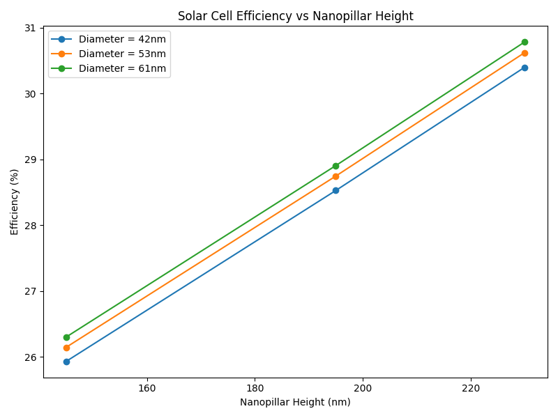
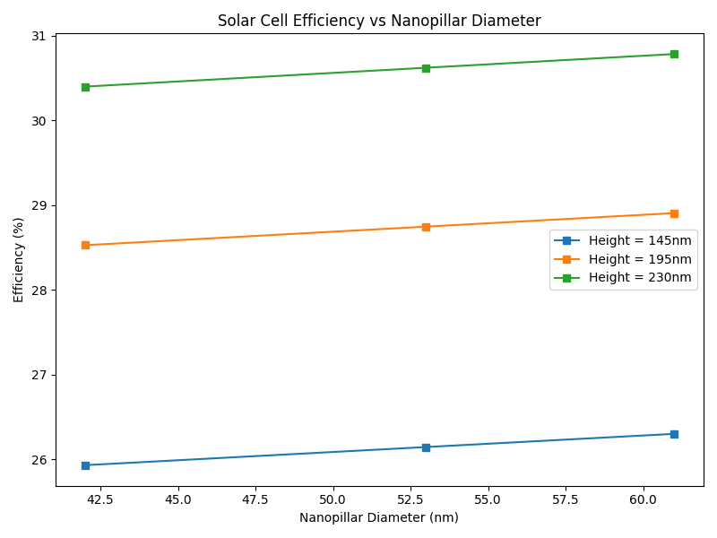

# Nanostructured Solar Cell Efficiency

## Overview
This project simulates the effect of nanopillar nanostructures on solar cell efficiency. It allows you to:

- Compute efficiency for different nanopillar heights and diameters
- Modify Jsc and FF based on nanostructure parameters
- Identify the best nanostructure configuration for maximum efficiency
- Visualize efficiency trends versus nanopillar height and diameter

The project is implemented in both a Python script and Jupyter notebook located in the `simulations/` folder for interactive exploration.

---

## Project Structure
```
Nanostructured_Solar_Cell_Efficiency/
│
├── plots/
├── csvs/
├── simulations/
│   ├── Nanostructured_Solar_Cell_Efficiency.ipynb
│   └── Nanostructured_Solar_Cell_Efficiency.py
├── requirements.txt
├── .gitignore
└── README.md
```

---

## Installation Instructions

1. **Clone the repository**
```bash
git clone https://github.com/mzohaibh17-pixel/Nanostructured_Solar_Cell_Efficiency.git
cd Nanostructured_Solar_Cell_Efficiency
```
2. **Create a virtual environment and activate it**
```bash
python -m venv venv
venv\Scripts\activate        # Windows
# source venv/bin/activate   # Linux / Mac
```
3. **Install dependencies**
```bash
pip install -r requirements.txt
```

---

## Features

This project provides a hands-on exploration of solar cell nanostructuring and its effect on efficiency. Key features include:

- Computes efficiency for a flat solar cell
- Computes modified Jsc and FF for multiple nanopillar heights and diameters
- Generates a results table of all configurations and efficiencies
- Plots:
  - Efficiency vs Nanopillar Height (for each diameter)
  - Efficiency vs Nanopillar Diameter (for each height)
- Identifies the best nanopillar configuration automatically
- Saves all plots automatically in the `plots/` folder
- Saves simulation results as CSV in `csvs/`
- Interactive exploration with Jupyter notebook in `simulations/`

---

## Usage

1. **Run the Jupyter notebook** (recommended):
```bash
jupyter notebook simulations/Nanostructured_Solar_Cell_Efficiency.ipynb
```
2. **Or run the Python script**:
```bash
python simulations/Nanostructured_Solar_Cell_Efficiency.py
```
- Plots will be saved automatically in the `plots/` folder.
- Results CSV will be saved in the `csvs/` folder.
- You can adjust parameters such as nanopillar heights, diameters, or flat cell parameters in the notebook or script to explore different scenarios.

---

## Outputs

The program generates the following results:

- **Flat Cell Efficiency:** Baseline efficiency of a flat solar cell
- **Nanostructured Cell Efficiency Table:** Efficiency for all height-diameter combinations
- **Plots:** Efficiency trends versus height and diameter
- **Best Configuration:** Automatically identifies the nanopillar combination with maximum efficiency
- **CSV File:** All results saved in `csvs/nanopillar_efficiencies.csv`

Example console output for best configuration:

```
Flat cell efficiency is: 18.15%

Best Nanostructure Configuration:
Height=230 nm, Diameter=61 nm, Efficiency=21.73%
```

---

## Dependencies

This project requires the following Python packages:
```
- Python 3.x
- numpy
- pandas
- matplotlib
```
*(All dependencies are included in `requirements.txt` for easy installation using `pip install -r requirements.txt`)*

---

## References

- Green, M. A., *Solar Cells: Operating Principles, Technology, and System Applications*, 2012
- Matplotlib Documentation: https://matplotlib.org/stable/contents.html
- Numpy Documentation: https://numpy.org/doc/
- Pandas Documentation: https://pandas.pydata.org/docs/

---

## Author / Credits

**Muhammad Zohaib Hassan**  
Bachelor’s in Physics, University of Sargodha  
GitHub: [mzohaibh17-pixel](https://github.com/mzohaibh17-pixel)  
Email: mzohaibh17@gmail.com  

This project is for educational and research purposes in computational and experimental physics.  
It is licensed under the **MIT License**, which requires including the copyright notice in any copies or substantial portions of the software.  
If you use, adapt, or fork this project, please give proper credit to the author.

---

## Visualizations

The following plots provide a visual summary of the Nanostructured Solar Cell Efficiency project.  
They help illustrate efficiency trends for different nanopillar heights and diameters.

### Efficiency vs Height


### Efficiency vs Diameter

